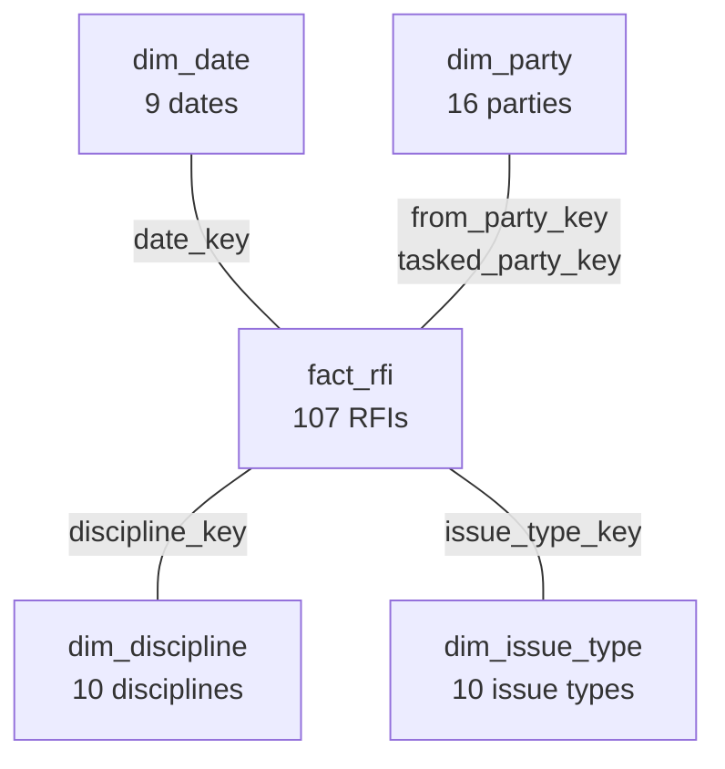
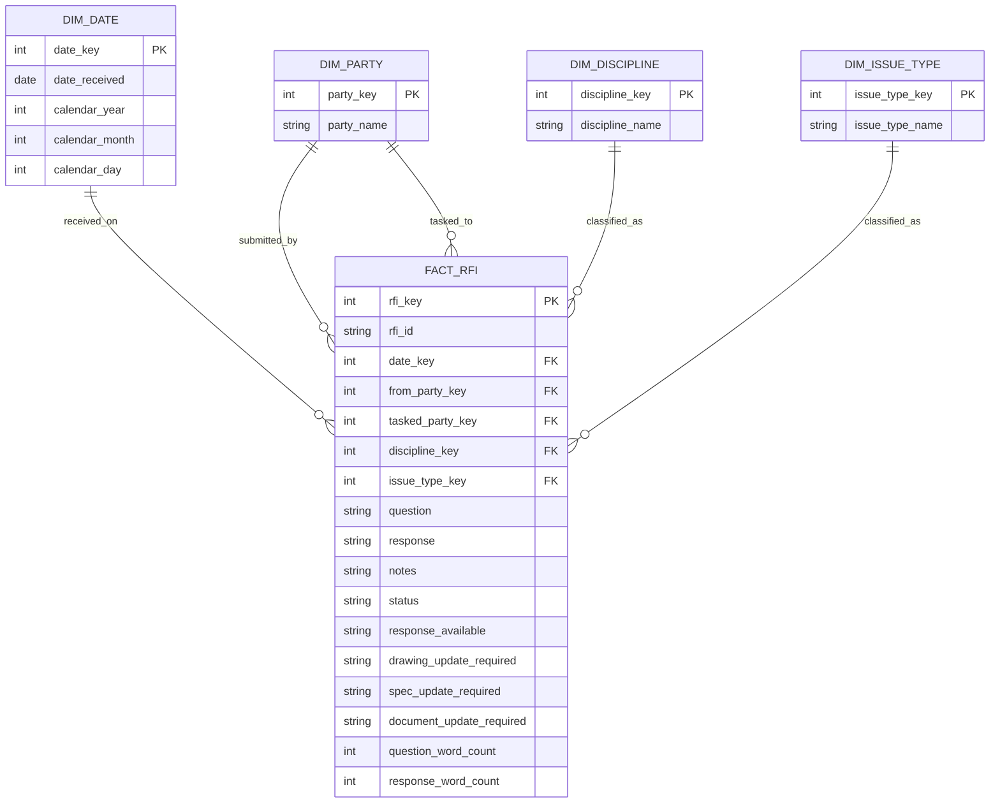

# RFI star schema

`fact_rfi` is the center of the model. Each of its 107 rows is one RFI. Four dimension tables describe the date, the parties, the discipline, and the issue type.

| Table | Rows | Grain |
|---|---:|---|
| `fact_rfi` | 107 | One row per RFI, `RFI-001` to `RFI-107` |
| `dim_date` | 9 | One row per received date |
| `dim_party` | 16 | One row per party name |
| `dim_discipline` | 10 | One row per discipline |
| `dim_issue_type` | 10 | One row per issue type |

## Relationships

Each fact row points at exactly one row in each dimension.

| Fact column | Dimension | Meaning |
|---|---|---|
| `date_key` | `dim_date.date_key` | Date the RFI was received. The key is `YYYYMMDD`. |
| `from_party_key` | `dim_party.party_key` | Party that submitted the RFI. |
| `tasked_party_key` | `dim_party.party_key` | Party tasked to answer the RFI. |
| `discipline_key` | `dim_discipline.discipline_key` | Derived engineering discipline. |
| `issue_type_key` | `dim_issue_type.issue_type_key` | Derived issue type. |

`dim_party` is one list of party names. Submitting and tasked parties are two foreign keys on the fact, so the same party can fill either role.

Question text, response text, notes, status, document-update flags, and word counts stay on `fact_rfi`. They describe that one RFI and are not reused as dimensions.

## Columns

The database is `data/processed/rfi.duckdb`, loaded by `src/database/07_load_rfi_duckdb.py` from `data/processed/rfi_features.csv`.
